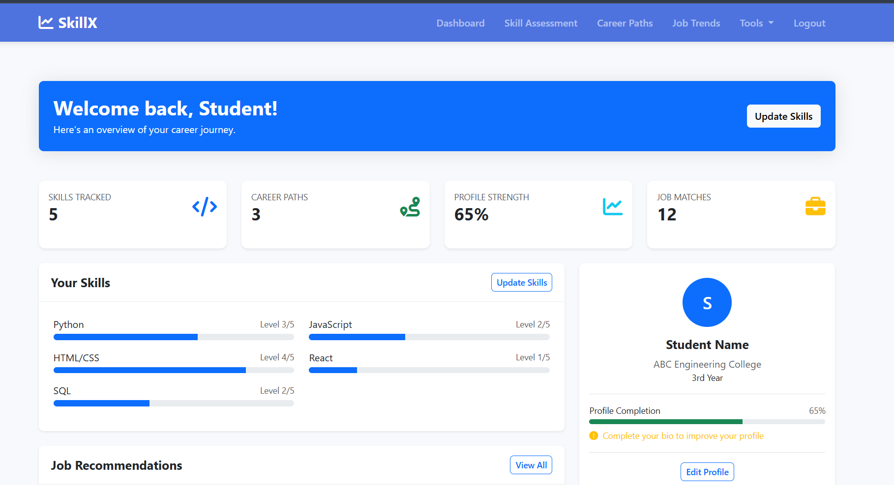
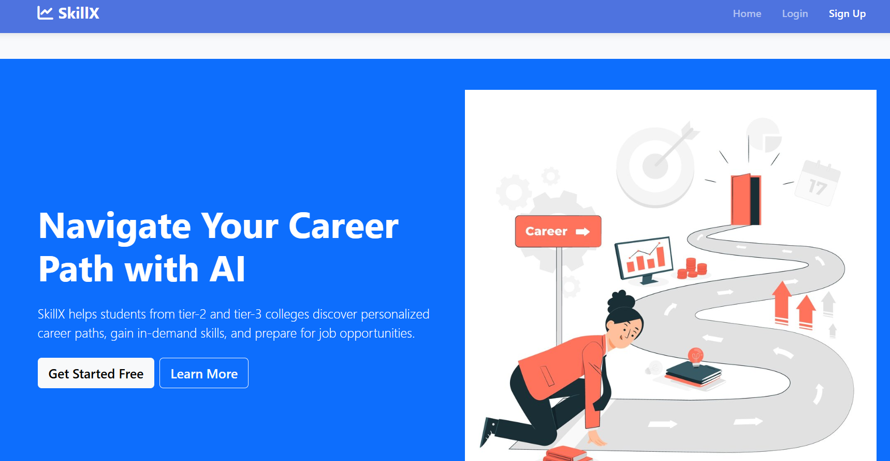
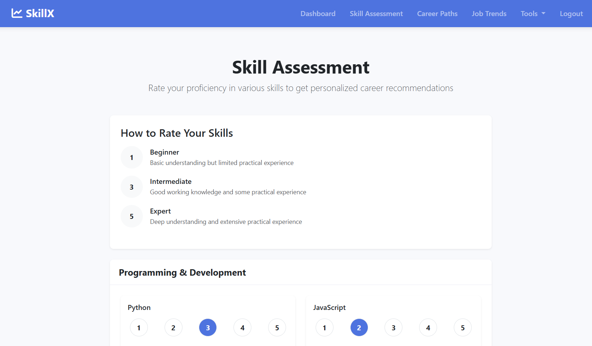
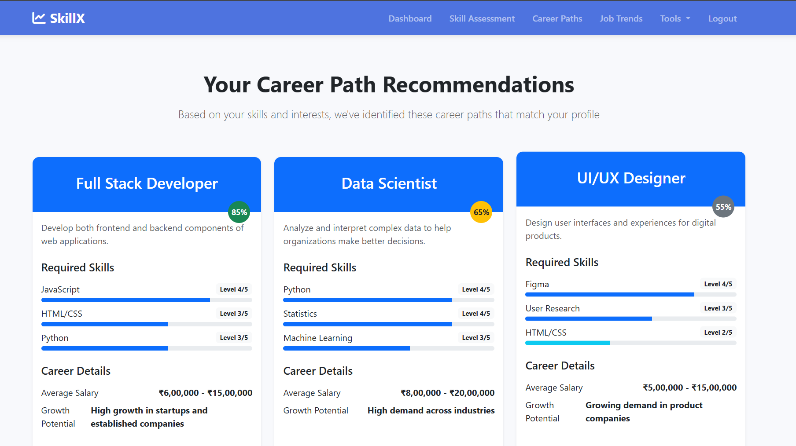
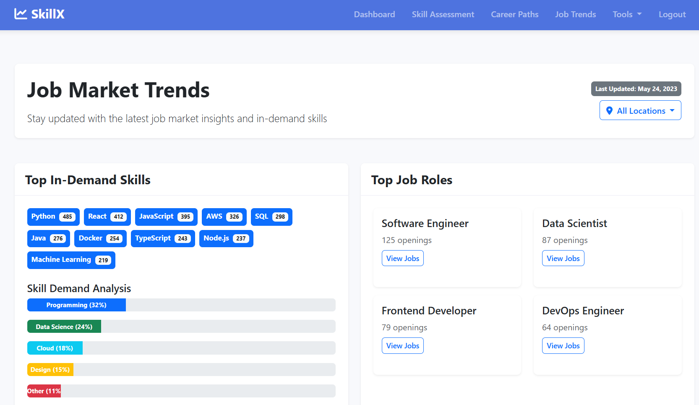
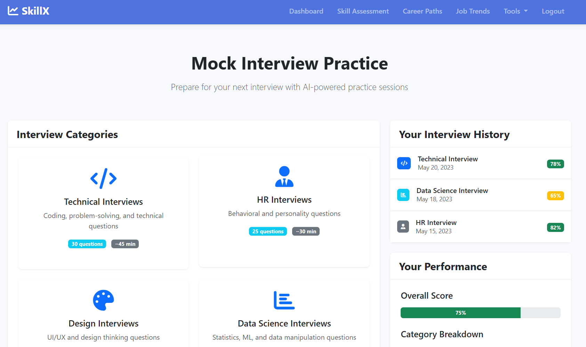
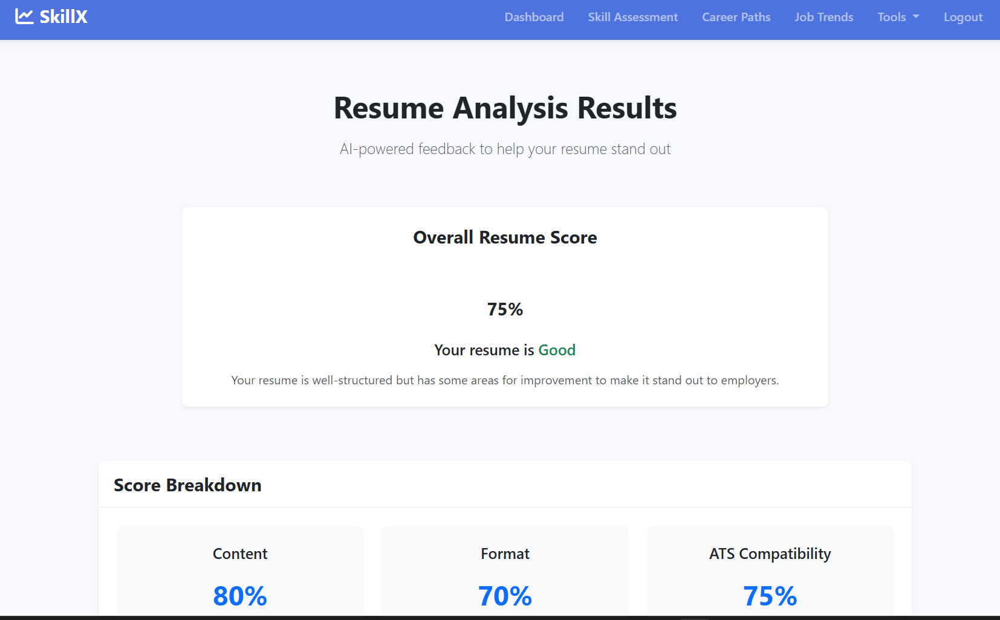

# 🌟 SkillX: Empowering Tier 3 College Students

> A skill-enhancing platform designed to bridge the gap for students in Tier 3 colleges by providing curated learning resources, project analysis, resume feedback, and job trend insights powered by AI.

---

Deployed Link : https://priyankapinky2004.github.io/SkillX/

## 🚀 Overview

**SkillX** is a centralized web platform that focuses on improving the **skills, education, experience**, and **career opportunities** of Tier 3 college students by offering:

- Personalized learning paths
- Resume and project analysis
- Trending job recommendations
- AI-based skill gap analysis
- Career readiness roadmap

---

## 🎯 Key Features

- 🔍 **Resume Analyzer:** Get real-time feedback and suggestions to improve your resume and project alignment with current industry demands.
- 📊 **Job Market Trends:** Analyze in-demand skills and roles using data from job platforms like LinkedIn, Indeed, etc.
- 🧠 **Skill Tracker:** Build and track your skills with personalized roadmaps, quizzes, and checkpoints.
- 💼 **Projects Dashboard:** Suggests impactful projects to strengthen resumes based on career goals.
- 🛠️ **Tech Stack Matcher:** Maps your current stack with trending jobs and recommends tools or frameworks to learn.
- 🌐 **Community Support:** Peer learning, mentorship, and Q&A forums.

---

## 📸 Screenshots

 
 
 
 

---

## 🧑‍💻 Tech Stack

| Category            | Tools Used                                      |
| ------------------- | ----------------------------------------------- |
| **Frontend**        | React.js, Tailwind CSS                          |
| **Backend**         | Node.js / Django / Flask (based on your choice) |
| **Database**        | MongoDB / PostgreSQL                            |
| **Authentication**  | Firebase / OAuth 2.0 / JWT                      |
| **Hosting**         | Vercel / Netlify / Heroku / AWS                 |
| **AI/ML**           | Python (NLP for Resume Analysis, Job Trends)    |
| **Version Control** | Git, GitHub                                     |

Clone the Repo :

git clone :  https://github.com/priyankapinky2004/SkillX.git

---
## 🤝 How to Contribute
We welcome all contributions! Here's how you can help:

- Fork the repository

- Create your feature branch: git checkout -b feature/YourFeature

- Commit your changes: git commit -m 'Add some feature'

- Push to the branch: git push origin feature/YourFeature

- Open a pull request

📜 License
---
This project is licensed under the MIT License - see the LICENSE file for details.

📬 Contact
---
📧 Email: priyanka.636192@gmail.com

🌐 LinkedIn: Priyanka Gowda

💼 Portfolio: (Add if you have one)

Made with ❤️ by Tier 3 students, for Tier 3 students.

---

### ✅ What to do next:

- Replace placeholders like repo URL, contributor GitHub profile links, and screenshot paths.
- Add your project screenshots or demo video.
- Upload to your GitHub repo as `README.md` in the root directory.

Let me know if you want me to generate badges, GitHub Actions workflows, or a contribution guide (`CONTRIBUTING.md`) too.
---